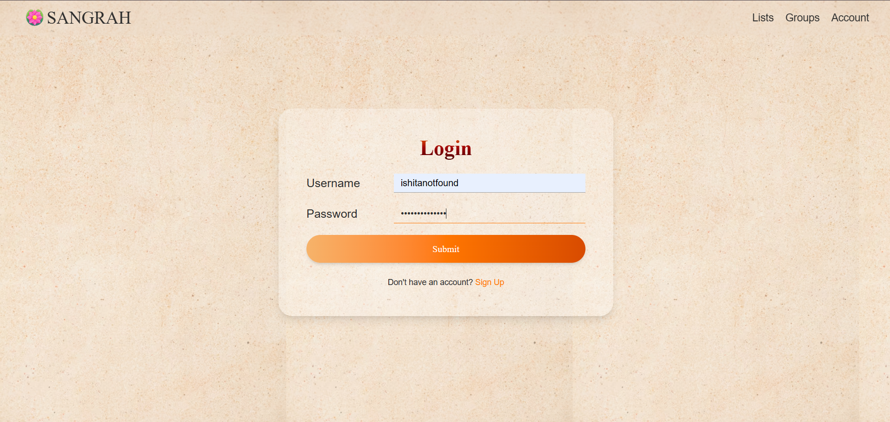
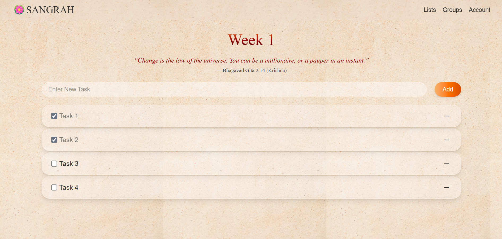
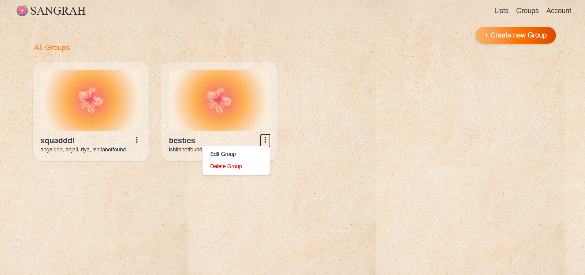
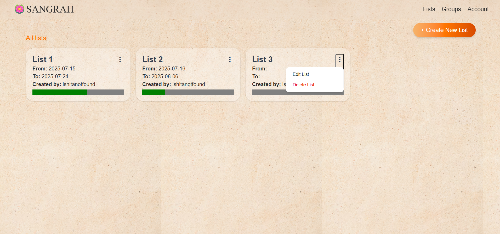
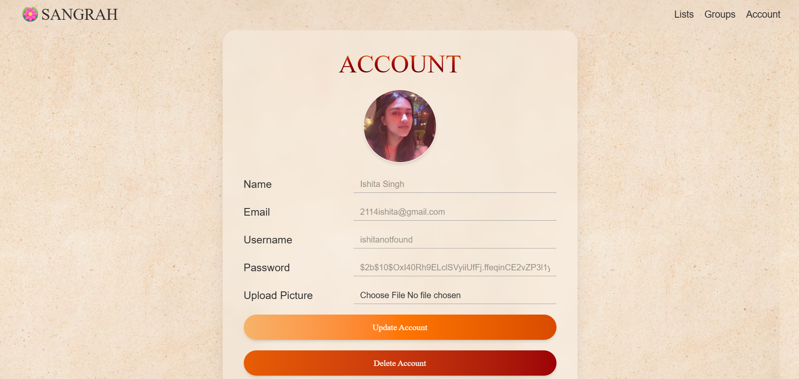

# 🌸 Sangrah – Your Personal and Shared To-Do Manager

Sangrah is a spiritual and collaborative productivity app that lets you organize your personal tasks and collaborate on shared goals with friends or teams. Rooted in calm aesthetics like **morpankhs** and **lotus flowers**, Sangrah brings focus and serenity to your productivity.

📱 **Fully Responsive** — Mobile, Tablet, Desktop friendly  
 
🔒 **Secure & Smooth** — JWT auth, persistent login  
🪶 **Spiritual Touch** — Gita quotes on every to-do list page

Live Demo 👉 [Frontend on Vercel](https://sangrah-ten.vercel.app)  
Backend 👉 [Render Deployment](https://sangrah-backend.onrender.com)

---

## ✨ Features

### 🏡 Hero Page
- Spiritual design with **morpankhs (peacock feathers)** and **lotus flowers**
- Subtle animations powered by **GSAP**
- Simple call-to-action for login/signup

### 🔐 Authentication
- Secure SignUp and Login using **JWT tokens**
- Upload **Display Picture** from Accounts
- Session persistence (stays logged in for 7 days)

### ✅ Lists
- Create personal to-do lists with:
  - **Title**, **Start and End Dates**, **Optional Image**
- Each list page displays a **rotating Bhagavad Gita teaching**
- Track progress visually with **completion bars**
- Edit, update, and delete your lists anytime

### 👥 Groups
- Create groups with a **name** and optional **group picture**
- Add members via their **usernames**
- Share or link your lists with group members
- All group members can **collaboratively edit shared lists**
- Rename or delete groups/lists

### ⚙️ Account Settings
- View your profile: **Name**, **Username**, **Email**, **Display Picture**
- Edit profile info, delete account, and logout easily

---

## 🧱 Tech Stack

### 🚀 Frontend
- **React**
- **Tailwind CSS**
- **React Router**
- **GSAP** for animations
- **Axios**

### 🔧 Backend
- **Node.js**
- **Express.js**
- **MongoDB + Mongoose**
- **JWT Authentication**
- **Multer + Cloudinary** for image uploads
- **CORS**, **dotenv** for environment configs

---

## 📂 Folder Structure

### Frontend
src/   
├── api/   
│ ├── userAPI.js   
│ ├── listAPI.js  
│ ├── groupAPI.js   
| └── authHeader.js   
├── components/   
│ ├── home /   
|   ├── Navbar.jsx   
|   ├── Hero.jsx   
|   └── Account.jsx   
| ├── groups /   
|   ├── CreateGroup.jsx   
|   ├── CreateGGroup.jsx   
|   ├── Groups.jsx   
|   ├── GroupView.jsx   
|   └── UpdateGroup.jsx   
|  ├── lists /   
|   ├── CreateList.jsx   
|   ├── UpdateList.jsx   
|   ├── ListShow.jsx   
|   └── Lists.jsx   
|  ├── register /   
|   ├── Login.jsx   
|   └── SignUp.jsx   

### Backend
backend/   
├── config /   
| └── db.js   
├── models/   
│ ├── User.js   
│ ├── List.js   
│ └── Group.js   
├── routes/   
│ ├── userRoutes.js   
│ ├── listRoutes.js   
| ├── gitaAPI.js   
│ └── groupRoutes.js   
├── middleware/   
│ ├── authMiddleware.js   
│ └── upload.js   
├── utils/   
│ ├── generateToken.js   
│ └── cloudinary.js   
└── index.js   